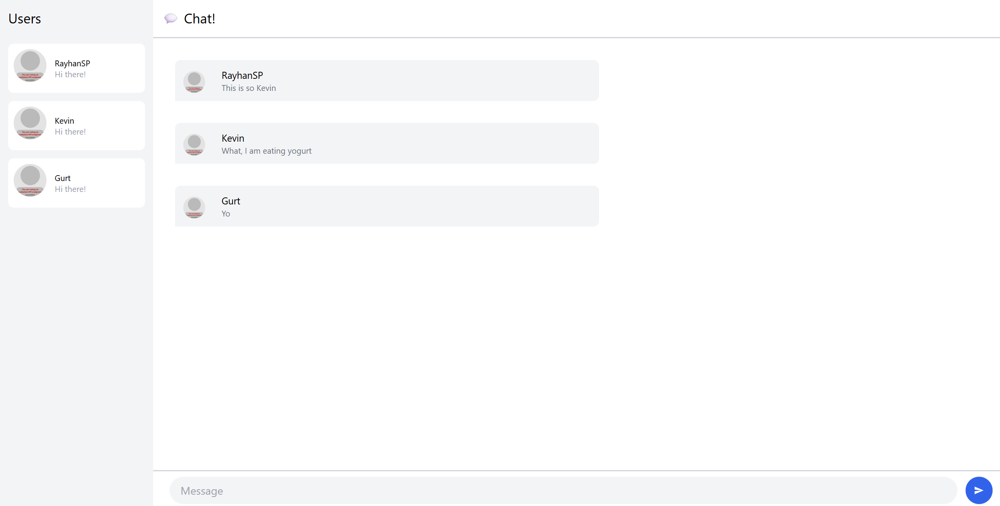
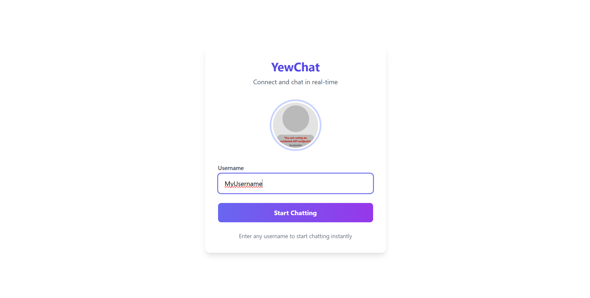
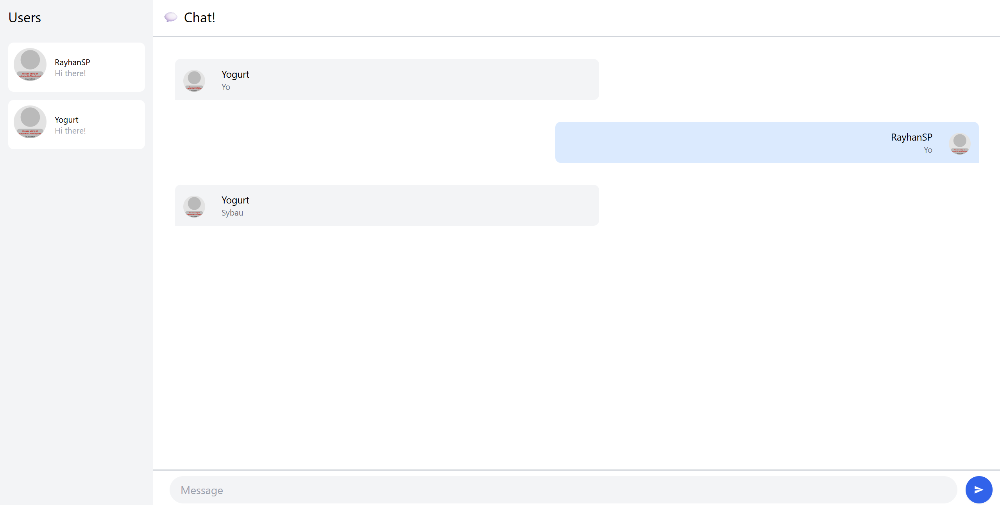

# YewChat 
## Experiment 3.1: Original code

Pada eksperimen ini, saya menjalankan SimpleWebSocketServer terlebih dahulu sebagai server WebSocket. Setelah server berjalan, saya menjalankan aplikasi YewChat. Terlihat bahwa aplikasi berhasil terhubung ke server dan memungkinkan komunikasi chat secara real-time antar client. Hal ini menunjukkan bahwa integrasi antara server WebSocket dan aplikasi YewChat berjalan dengan baik.

### Hasil
Berikut adalah tangkapan layar dari eksperimen:

## Experiment 3.2: Be Creative!

Pada eksperimen ini, saya melakukan beberapa perubahan kreatif pada aplikasi YewChat untuk meningkatkan pengalaman pengguna. Perubahan pertama adalah memindahkan tampilan chat bubble pengguna aktif ke sisi kanan, seperti yang umum ditemukan pada aplikasi chatting modern seperti WhatsApp dan Telegram. Hal ini memberikan kesan yang lebih familiar dan intuitif bagi pengguna. Selain itu, saya juga merombak halaman login dengan desain yang lebih menarik, termasuk menambahkan avatar selamat datang dan animasi hover pada form login. Perubahan ini bertujuan untuk memberikan kesan pertama yang lebih profesional dan menyenangkan bagi pengguna.

### Hasil
Berikut adalah tangkapan layar setelah perubahan:

